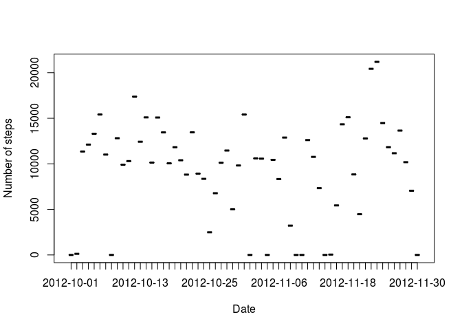
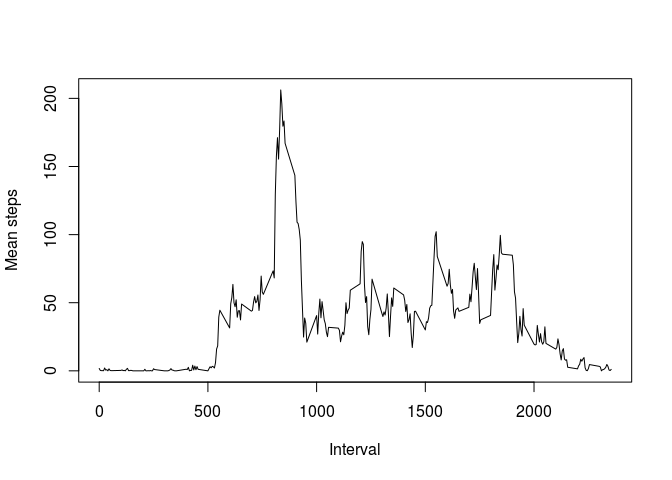
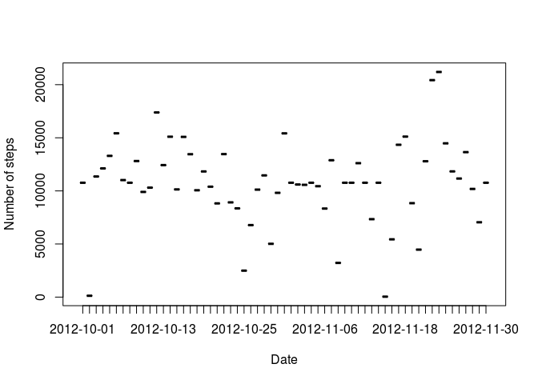
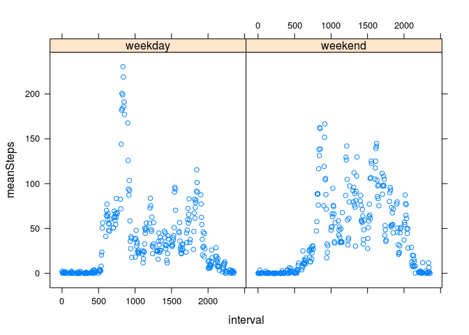

## Loading and preprocessing the data

```r
activity<-read.csv(file = "activity.csv", header = T)
```


## What is mean total number of steps taken per day?

```r
library(dplyr)
```

```
## 
## Attaching package: 'dplyr'
```

```
## The following objects are masked from 'package:stats':
## 
##     filter, lag
```

```
## The following objects are masked from 'package:base':
## 
##     intersect, setdiff, setequal, union
```

```r
totStepsPerDay<-
  activity %>%
  group_by(date) %>%
  summarize(totSteps=sum(steps,na.rm = T))
plot(x=totStepsPerDay$date,y=totStepsPerDay$totSteps, xlab="Date", ylab="Number of steps")
```

<!-- -->

```r
meanSteps<-mean(totStepsPerDay$totSteps)
medSteps<-median(totStepsPerDay$totSteps)
```
The mean of the steps is 9354.2295082 and the median is 10395.


## What is the average daily activity pattern?

```r
meanStepsPerInterval<-
  activity %>%
  group_by(interval) %>%
  summarize(meanSteps=mean(steps,na.rm = T))
plot(x = meanStepsPerInterval$interval,y=meanStepsPerInterval$meanSteps, type = "l", xlab = "Interval", ylab = "Mean steps")
```

<!-- -->

```r
maxStepsInterval<-meanStepsPerInterval[which.max(meanStepsPerInterval$meanSteps),1]
```
The interval that contains the maximum number of steps is 835.

## Imputing missing values

```r
numNA<-sum(!complete.cases(activity))
```
The missing values are 2304.

```r
#find the index of the NA's
indexIncomplete<-which(!complete.cases(activity))
#create new dataframe with index and the corresponding interval
dfReplace<-data.frame(indexIncomplete,interval=activity$interval[indexIncomplete])
#add a column to the dataframe merging with the mean for the corresponding interval
dfReplace<-merge(dfReplace,meanStepsPerInterval,by.x = "interval", by.y = "interval" )
#sort the dataframe by index
dfReplace<-dfReplace[order(dfReplace$indexIncomplete),]
#make new complete dataframe based on the incomplete one
activityComplete<-activity
#assign the value for the completed dataframe
activityComplete$steps[indexIncomplete]<-dfReplace$meanSteps

totStepsPerDayComplete<-
  activityComplete %>%
  group_by(date) %>%
  summarize(totSteps=sum(steps,na.rm = T))
plot(x=totStepsPerDayComplete$date,y=totStepsPerDayComplete$totSteps, xlab="Date", ylab="Number of steps")
```

<!-- -->

```r
meanStepsComplete<-mean(totStepsPerDayComplete$totSteps)
medStepsComplete<-median(totStepsPerDayComplete$totSteps)
```
The mean of the steps were 9354.2295082 and now is 1.0766189\times 10^{4}. The median were 10395 and now is 1.0766189\times 10^{4}.

## Are there differences in activity patterns between weekdays and weekends?

```r
library(lattice)
weekday<-weekdays(as.Date(activityComplete$date))
weekday[weekday %in% c("lunedì","martedì","mercoledì","giovedì","venerdì")]<-"weekday"
weekday[weekday %in% c("sabato","domenica")]<-"weekend"
activityComplete$weekday<-weekday
activityComplete$weekday<-as.factor(activityComplete$weekday)

meanStepsPerIntervalComplete<-
  activityComplete %>%
  group_by(interval,weekday) %>%
  summarize(meanSteps=mean(steps,na.rm = T))

xyplot(meanSteps~interval | weekday ,data=meanStepsPerIntervalComplete)
```

<!-- -->
